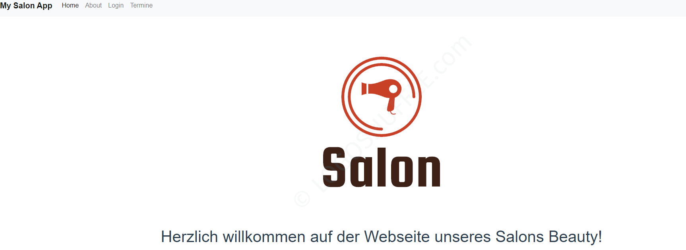
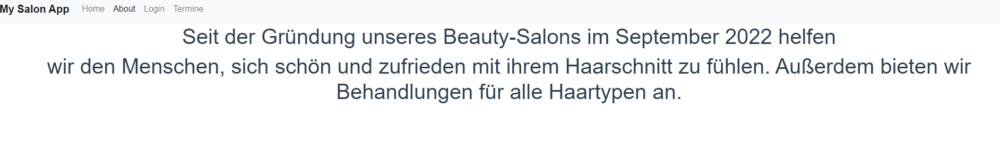
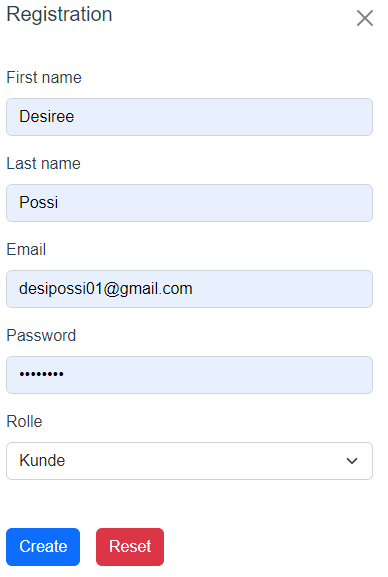
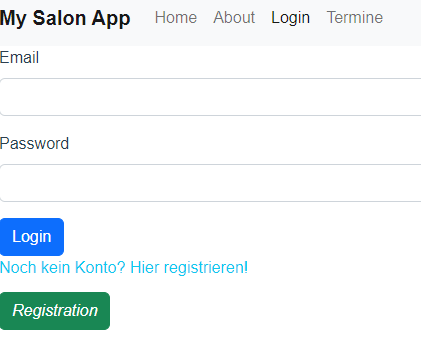
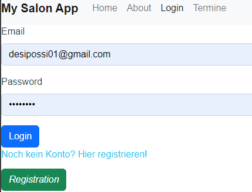
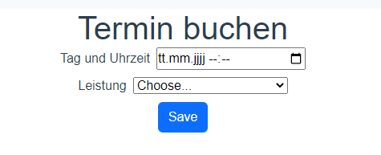
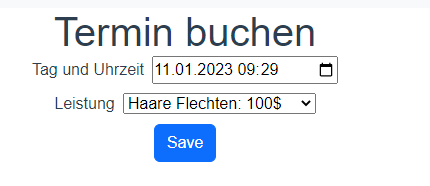
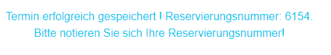
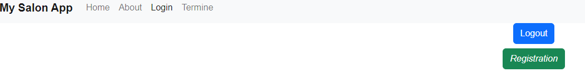

# webtech_projekt_frontend_ws2223
Implementierung eines Online-Portals, wo man einen Termin zum Friseur vereinbaren kann.
-Ein Konto kann entweder als Mitarbeiter des Salons oder als Kunde oder als admin angelegt werden.
-Wenn die Daten angelegt sind, werden sie in einer Datenbank "SalonDB" gespeichert.
Home: 
About: 
1-Funktionalitäten des/der Nutzers_in:

- Auf der Seite kann sich der/die Nutzer_in entweder registrieren oder anmelden, wenn er bereits ein Benutzerkonto hat.
*Registrierung:
- 
*Login:

- Danach hat der/die Nutzer_in die Möglichkeit, einen Termin zu vereinbaren. Ein Termin kann vereinbart werden, nur wenn man angemeldet ist Dazu muss er/sie den gewünschten Tag
  eingeben, an dem er/sie einen Termin haben möchte. der/die Nutzer_in wählt dann die gewünschte Uhrzeit und den Tag und die Leistung aus und
  bestätigt die:
  Eingabe:
- Nach Erfolg der Terminbuchung, bekommt der/die Nutzer_in eine Reservierungsnummer, die er/sie notiert muss.
- der/die Nutzer_in kann sich dann ausloggen und zur Startseite zurückkehren.


## Project setup
```
npm install
```

### Compiles and hot-reloads for development
```
npm run serve
```

### Compiles and minifies for production
```
npm run build
```

### Run your unit tests
```
npm run test:unit
```

### Lints and fixes files
```
npm run lint
```

### Customize configuration
See [Configuration Reference](https://cli.vuejs.org/config/).
